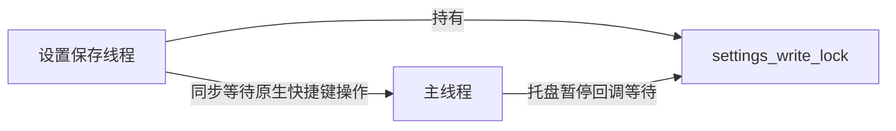

> 已归档（2026-09-29）：已完成工作的历史记录，不作为当前指导；当前状态见 `docs/dev/STATUS.md`。

# 全仓代码审查 — 2026-09-07

审查基准：修复前的工作区（包含尚未提交的 QuickBar 重构），不是已发布的 v2.2.1 包。下方保留原始发现，修复结果以本节为准。

## 修复结果（2026-09-07）

审计列出的 B1–B9、O1、T1–T4、K1、3 个较小交互问题和全部精简项均已落实。主要结果：设置与迁移的阻塞工作移出主/Tokio 线程；运行中数据路径以实际数据库为准；设置读取失败会暂停采集；快捷键录制在隐藏、失焦和销毁时可靠恢复；图片沿用捕获时间；历史上限覆盖重复、降低上限和取消置顶；文件列表改为兼容旧记录的 JSON；文件写回核对完整 URL 集合；合并限制为 50 MB；数据库升级到 v3 并自动备份；发布流程纳入双浏览器回归；原生 QA 增加隔离与剪贴板恢复校验。

同时删除无用路由/存储方法/重复设置默认值与两个直接开发依赖，更新兼容基线和依赖。相同 1 MiB 备份探针由约 1.52 秒降至 1.74 毫秒（单次样本）。修复后验证：132 项 Rust（另 1 ignored）、56 项 Bun、36 项 Chromium/WebKit，lint、Svelte/TypeScript、build、clippy、fmt、依赖审计全部通过；原生结果见 `STATUS.md`。

## 结论与验证范围

现有自动化全部通过，但仍有需要修复的并发、数据路径和交互问题。优先处理 B1–B5，再处理备份性能、文件边界和发布检查；不需要更换框架、引入数据库连接池或继续大规模拆模块。

- 审查覆盖 `src/`、`src-tauri/src/`、原生 QA/发布脚本、GitHub 工作流和项目 hooks，共 58 个源码/脚本/工作流文件；另核对 IPC 类型、权限、构建配置、依赖和测试。
- 现有基线重跑：125 项 Rust（另 1 ignored）、55 项 Bun、30 项 Chromium/WebKit；lint、Svelte/TypeScript、测试类型检查、build、clippy、fmt、cargo build 和版本一致性检查通过。
- 对 28 个 Svelte 组件/模块运行静态分析；录制快捷键组件的两处无 key 循环只是小规模渲染建议，不作为实质缺陷计数。
- 新探针使用实际项目模块/编译后的 Svelte，数据库与文件均为临时合成数据；没有操作日常剪贴板或日常数据库。浏览器 IPC 为模拟，不能替代原生平台验证。
- 下文区分“探针复现”和“调用链确认”。本轮未强行制造原生死锁，也未重做 Windows/Linux、多屏或受保护目录 TCC 实测。

## 优先修复

### B1 · P1：设置写入与托盘暂停存在死锁交错【调用链确认】

位置：[commands.rs:697](/Users/rustypiano/项目/ClipMan/src-tauri/src/commands.rs:697)、[tray.rs:309](/Users/rustypiano/项目/ClipMan/src-tauri/src/tray.rs:309)。

`update_settings` 在后台线程持有 `settings_write_lock`，期间同步注册/注销快捷键。已安装的 `tauri-plugin-global-shortcut 2.3.2` 的 `run_main_thread!` 会向主线程投递任务，然后 `rx.recv()` 等待完成。如果主线程此时处理托盘“暂停采集”，它又会阻塞等待同一设置锁，形成循环等待。迁移持有此锁并调用原生托盘更新，也需要一起核对。



最小修复：托盘设置写入移到后台执行，主线程不等待业务锁；保留设置写入的串行性和回滚。不要通过删掉锁来“修复”。

### B2 · P1：回退后的真实数据库位置没有贯穿界面与迁移【调用链确认】

位置：[main.rs:101](/Users/rustypiano/项目/ClipMan/src-tauri/src/main.rs:101)、[commands.rs:811](/Users/rustypiano/项目/ClipMan/src-tauri/src/commands.rs:811)、[commands.rs:954](/Users/rustypiano/项目/ClipMan/src-tauri/src/commands.rs:954)。

自定义目录打开失败时，启动流程会实际使用默认目录，但保留 `settings.custom_data_path`。随后“当前数据位置”和迁移的 `old_path` 又从该配置推导，而不是从已打开的数据库推导。

后果：界面显示错误位置；旧配置目录不存在时迁移被错误阻止；若该目录稍后恢复可访问，迁移会备份实际默认库，却在勾选“删除旧数据”后清理配置指向的另一份库，造成备份与删除对象不一致。

最小修复：从实际打开的存储获取运行中的数据路径，供位置展示、迁移源和清理统一使用；配置路径仅表示启动偏好。

### B3 · P1：录制快捷键时关闭设置，不恢复全局快捷键【双浏览器探针复现】

位置：[GeneralSettings.svelte:79](/Users/rustypiano/项目/ClipMan/src/lib/components/settings/GeneralSettings.svelte:79)、[GeneralSettings.svelte:175](/Users/rustypiano/项目/ClipMan/src/lib/components/settings/GeneralSettings.svelte:175)、[settings/+page.svelte:230](/Users/rustypiano/项目/ClipMan/src/routes/settings/+page.svelte:230)、[window.rs:207](/Users/rustypiano/项目/ClipMan/src-tauri/src/window.rs:207)。

开始录制后快捷键被禁用，恢复只在停止录制或组件销毁时执行。然而设置窗口关闭是 `hide`，不销毁组件。点设置页返回按钮同样隐藏窗口。

探针实际调用顺序：

```text
get_settings → get_current_data_path → disable_global_shortcut
→ show_quickbar → plugin:window|hide
```

没有 `enable_global_shortcut`；两种浏览器中“关闭后应恢复”的断言均失败。主快捷键会持续不可用，直到再次进入设置取消录制或重启。

最小修复：隐藏/关闭/离开录制页统一结束录制，同时处理禁用请求尚未完成就离开的情况，不能只依赖 `onDestroy`。

### B4 · P1：图片历史按处理完成时间排序，仍可能把旧图片排到最新【调用链确认】

位置：[clipboard.rs:516](/Users/rustypiano/项目/ClipMan/src-tauri/src/clipboard.rs:516)、[clipboard.rs:540](/Users/rustypiano/项目/ClipMan/src-tauri/src/clipboard.rs:540)。

图片经过异步缩放/编码后才生成时间戳。先复制大图 A、随后复制文本 B，如果 A 后处理完成，A 会得到更晚的时间戳，排在 B 前。小数秒修复了“同一秒按随机 ID 排序”，但没有解决这个独立的异步顺序问题。

最小修复：像 `source_app` 一样，在分发后台任务前保存捕获时间，处理完成后沿用；补“大图后紧接文本”和两张图片完成顺序相反的回归。

### B5 · P1：设置读取失败后静默使用默认隐私规则并继续采集【调用链确认】

位置：[main.rs:306](/Users/rustypiano/项目/ClipMan/src-tauri/src/main.rs:306)、[settings.rs:121](/Users/rustypiano/项目/ClipMan/src-tauri/src/settings.rs:121)。

设置文件损坏或不可读时，只写日志并继续使用默认值；默认 `ignored_apps` 为空、`capture_paused` 为 false。用户原先暂停采集或排除的应用不再受原规则保护，前端 `get_settings` 仍返回成功，因此看不到加载失败提示。

最小修复：区分首次运行“无配置”和已有配置读取失败；后者应明显提示并暂停自动采集，保留原文件，避免静默丢失隐私偏好。

## 正确性边界与性能

| ID | 级别与证据 | 问题及建议 |
| --- | --- | --- |
| B6 | P2，实际存储模块探针复现 | [storage.rs:321](/Users/rustypiano/项目/ClipMan/src-tauri/src/storage.rs:321)：重复内容路径提前返回，不执行裁剪。已有 3 条、上限改为 1 后重复复制旧内容，仍留 3 条；设置降低上限本身也不裁剪。应在上限变更及重复捕获路径执行同一裁剪逻辑，并明确取消置顶后的上限语义。 |
| B7 | P2，实际文件/存储函数探针复现 | [storage.rs:1097](/Users/rustypiano/项目/ClipMan/src-tauri/src/storage.rs:1097)：换行分隔文件路径并非无损。macOS/Linux 允许文件名包含换行；探针创建一个这样的文件，编码解码后变成两个路径。改用 JSON 数组等无损格式，兼容读取旧记录；注释“换行非法”需纠正。 |
| B8 | P2，静态确认，需补部分拒绝的 TCC 实测 | [paste.rs:436](/Users/rustypiano/项目/ClipMan/src-tauri/src/paste.rs:436)：文件 URL 写回只检查落地数量大于 0，不能证明所有选中文件均已写入。应核对实际 URL 集合/缺失项，不能把部分成功当成完整成功。 |
| B9 | P2，资源上限分析 | [paste.rs:103](/Users/rustypiano/项目/ClipMan/src-tauri/src/paste.rs:103)、[paste.rs:220](/Users/rustypiano/项目/ClipMan/src-tauri/src/paste.rs:220)：合并仅限制条目数，未限制总字节数，且同时持有原始内容、逐项字符串副本和合并字符串。允许 10000 条、单条最大 50MB，并不构成可用的内存上限。应先限制总量，再使用借用字符串或单次追加，避免多份复制。 |
| O1 | P2，实际存储模块计时 | [storage.rs:463](/Users/rustypiano/项目/ClipMan/src-tauri/src/storage.rs:463)：每复制 5 页就固定等待 25ms，连正常的 `More` 状态也休眠。1MiB 合成 BLOB 的备份实测约 **1.52 秒**（单次诊断样本，非 p95）。按默认 4KiB 页估算，100MiB 单固定等待就约两分钟。迁移已停监控并持有存储锁，这种节流没有为本应用释放读取机会。应增大批次、缩短等待/仅遇忙锁退避，并将整段阻塞迁移工作移出 Tokio 执行线程。 |

## 发布、兼容性与测试工具

- **T1 · P2：标签发布漏跑浏览器回归。** [release.yml:47](/Users/rustypiano/项目/ClipMan/.github/workflows/release.yml:47) 没有安装浏览器或执行 `test:ui`；普通 CI 有此门禁，但发布流程不会等待它。将同一浏览器门禁接入 release preflight，避免标签构建绕过 QuickBar 回归。
- **T2 · P2：最低运行要求与前端技术栈不一致。** [tauri.conf.json:74](/Users/rustypiano/项目/ClipMan/src-tauri/tauri.conf.json:74) / README 声称 macOS 10.13，Vite 目标含 Safari 13/Chrome 100；Tailwind 4 的实际基线是 Safari 16.4、Chrome 111、Firefox 128。降低 JS 编译目标不会补齐 `color-mix` 等 CSS 能力。应明确真实 WebView 基线，再统一安装约束、构建目标和文档。依据：[Tailwind 官方兼容说明](https://tailwindcss.com/docs/compatibility)。
- **T3 · P2：原生 QA 脚本的隔离检查还不充分。** [run.py:44](/Users/rustypiano/项目/ClipMan/scripts/native-qa/run.py:44) 只拒绝已运行的 QA 实例，没检查日常 ClipMan 实例；后者可能采集测试写入系统剪贴板的合成内容。脚本也没有在启动前拒绝指向日常目录的 QA `customDataPath`。应先验证两者，安全前置条件用显式错误而不是会被 `python -O` 移除的 `assert`。
- **T4 · P2：恢复剪贴板未确认成功就删除备份。** [control.swift:115](/Users/rustypiano/项目/ClipMan/scripts/native-qa/control.swift:115) 忽略 `writeObjects` 返回值，[run.py:138](/Users/rustypiano/项目/ClipMan/scripts/native-qa/run.py:138) 随后直接删备份。应传播恢复失败并保留备份；不能一律打印“已恢复”。本轮没有重新运行会操作系统剪贴板的 QA 脚本。
- **K1 · 已知发布风险，非新发现：小数秒数据不兼容旧版读取。** 当前 `user_version` 仍为 2，旧二进制按整数读时间戳。已有验收记录说明不能直接降级，但缺少明确格式版本与升级前备份流程。发布前应补齐；仅增加版本号并不能让已经发布的旧二进制自动支持新格式。

## 较小但值得修正的交互问题

- [paste.rs:449](/Users/rustypiano/项目/ClipMan/src-tauri/src/paste.rs:449)：文件写入失败的通知在 Windows 也会编译使用，却只讲 macOS 权限且固定中文；应按平台和语言说明实际的路径文本回退。
- [index.html:2](/Users/rustypiano/项目/ClipMan/index.html:2)、[i18n/index.svelte.ts:701](/Users/rustypiano/项目/ClipMan/src/lib/i18n/index.svelte.ts:701)：HTML `lang` 固定为 `zh-CN`，切到英文时未同步，读屏语言声明不准确。
- [AppearanceSettings.svelte](/Users/rustypiano/项目/ClipMan/src/lib/components/settings/AppearanceSettings.svelte)：主题/语言使用按钮模拟 radio，但未实现 radio 的方向键选择。可保留现有卡片外观，使用原生 radio 输入补齐键盘行为。

## 可以精简的地方（不牺牲保护措施）

- `delete:` 删除不可达的内嵌设置路由分支和 [router.svelte.ts](/Users/rustypiano/项目/ClipMan/src/lib/stores/router.svelte.ts)；实际入口已经由原生窗口 label 决定，`goToSettings` 只在该判断内被调用。保留原生窗口导航。
- `native:` [MarkdownContent.svelte](/Users/rustypiano/项目/ClipMan/src/lib/components/ui/MarkdownContent.svelte) 的六级标题分支改成受限于 h1–h6 的 `svelte:element`，保留 token 渲染和 URL/HTML 安全处理。
- `delete:` 删除无调用者的 [storage.rs:727](/Users/rustypiano/项目/ClipMan/src-tauri/src/storage.rs:727) `update_timestamp`；所有取用已经走 `touch_timestamps`，同时纠正旧注释。
- `shrink:` [migration.rs:194](/Users/rustypiano/项目/ClipMan/src-tauri/src/migration.rs:194) 的 SHA256 helper 与 storage 重复；复用已有 helper，不再新建公共工具层。
- `shrink:` [ClipboardSettings.svelte](/Users/rustypiano/项目/ClipMan/src/lib/components/settings/ClipboardSettings.svelte) 仍有过时的字段可选说明、默认值兜底和可直接使用 `bind:checked` 的重复事件处理；设置页现在只在拿到完整后端设置后渲染。删除这些，保留范围校验。外观页 `getThemeLabel` 也可直接用 `t[key]`。
- `delete:` 移除 [package.json](/Users/rustypiano/项目/ClipMan/package.json) 中未直接使用的 `autoprefixer` 和 `postcss` 开发依赖声明。项目使用 Tailwind Vite 插件，没有 PostCSS 配置；Vite 自己依赖 PostCSS，因此不能宣称 PostCSS 会从整个依赖树消失。Tailwind 自带前缀处理，见官方兼容说明。

net: 约 -75 行、-2 个直接开发依赖声明可行（估算，尚未应用）；不需要改运行时架构。

## 依赖审计与保留项

`bun audit --production --json` 本次返回空对象；全量审计涉及 6 个开发依赖包、15 条告警记录：brace-expansion、browserslist、nanoid、picomatch、postcss、postcss-selector-parser。应沿依赖链升级并复查；这些告警不能直接解释为发布应用存在 15 个可利用漏洞。本机未安装 cargo-audit/cargo-deny，RustSec 漏洞库检查不在本次已完成验证之内。

保留：Tauri/Svelte/SQLite；单个系统剪贴板的操作互斥；请求序列与取消标记；数据库替换回滚；监控启动的 `run_returned` 保护；文件 URL 落地检查；Markdown 安全过滤；有限详情缓存。它们解决实际问题，不应为了减少行数删除。

## 复现证据

临时证据目录：[/tmp/clipman-full-audit](/tmp/clipman-full-audit)。

- `settings-probe.spec.ts` / `settings-probe.log`：复用实际设置页，两种浏览器中正确行为断言均失败；探针标记预期失败，所以 Playwright 汇总显示通过，含义是**确认缺陷**，不是缺陷已修复。临时放入 e2e 的副本已清理。
- `rust/src/lib.rs`：通过 `#[path]` 引入项目真实 storage/migration 模块，没有复制实现；探针确认上限 1 仍留 3 条、一个合法文件名变成两个路径，以及 1MiB 备份的计时。
- `dependency-audit.json`、`coverage.txt`、`svelte/`：依赖告警、审查文件清单、组件静态分析输出。

建议执行顺序：先 B1/B2/B5（死锁、路径、隐私），再 B3/B4（快捷键与捕获顺序），然后 O1/B6–B9 和发布/测试工具保护，最后做小规模精简。上述结论仍需修复后的回归验证；本次审查没有提交或发布。
